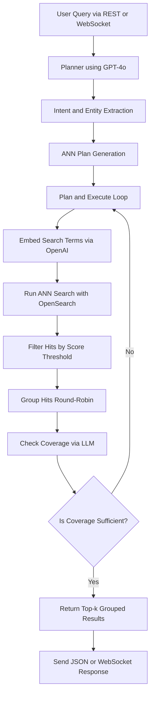

# 🧠 RASS Engine Backend

A dynamic, LLM-based Retrieval-Augmented Generation (RAG) or Retrieval-Augmented Semantic Search (RASS) engine backend for intelligent search over files/documents. This system interprets natural language queries, generates multi-hop embedding search plans, and retrieves semantically relevant documents via OpenSearch and OpenAI embeddings.

---



## ⚙️ Core Features

- **Agentic/LLM-based Planner + Executor Loop**
  Leverages GPT-4o to extract entities, expand terms, and build a multi-step ANN plan from natural queries.

- **ANN Search via OpenSearch (HNSW)**
  Efficient vector search over document embeddings using 'knn_vector' with score threshold filtering.

- **Interleaved Multi-Entity Result Retrieval**
  Returns top-k interleaved results across query entities (X1, Y1, Z1, X2 ...) to ensure balanced relevance.

- **WebSocket + REST API Support**
  Real-time and stateless access methods for seamless front-end integration.

---

## 🧰 Tech Stack

| Component      | Technology                      |
| -------------- | ------------------------------- |
| API Server     | Node.js + Express.js            |
| Embeddings     | OpenAI (text-embedding-ada-002) |
| Search Engine  | OpenSearch (HNSW, KNN)          |
| Planner Model  | GPT-4o                          |
| Socket Support | WebSocket Server (WSS)          |
| Auth           | JWT                             |

---

## System Overview & Document Ingestion

The `rass-engine` is the querying backend of a Retrieval Augmented Semantic Search system. It is designed to interpret natural language queries, generate search plans, and retrieve relevant documents from an OpenSearch index.

**Important Note on Document Ingestion:** This `rass-engine` **does not handle document ingestion** (uploading, chunking, embedding, and indexing into OpenSearch). This process is managed by a separate service.

For the intended workflow, you will need to use the **[embedding-service](https://github.com/NeuralRevenant/embedding-service)** (or your own compatible ingestion pipeline) to populate your OpenSearch index (`redmine_index` by default) with document embeddings. Once documents are ingested into OpenSearch by the `embedding-service`, the `rass-engine` can then query them.

---

## Prerequisites

- **OpenSearch:** This engine requires a running OpenSearch (or Elasticsearch compatible) instance. For local development, Docker is a convenient way to run OpenSearch.

  ```bash
  # Example Docker command for OpenSearch (adjust memory as needed, e.g., -Xms1g -Xmx1g for 1GB)
  docker run -p 9200:9200 -p 9600:9600 -e "discovery.type=single-node" -e "OPENSEARCH_JAVA_OPTS=-Xms512m -Xmx512m" --name opensearch-node -d opensearchproject/opensearch:latest
  ```

- **WSL Users:** If running Docker Desktop on WSL (Windows Subsystem for Linux) for OpenSearch, you will likely need to increase the vm.max_map_count setting on your WSL distribution. To set this temporarily (resets on WSL restart):

  ```bash
  sudo sysctl -w vm.max_map_count=262144
  ```

  For a permanent change, add the following line to `/etc/sysctl.conf`:

  ```bash
  vm.max_map_count=262144
  ```

- **Node.js and npm:** Ensure you have Node.js (v18 or later) and npm installed. You can check your versions with:
  ```bash
  node -v
  npm -v
  ```

## 🚀 Getting Started

### 1. Install Dependencies

```bash
git clone https://github.com/NeuralRevenant/rass-engine.git
cd rass-engine
npm install
```

### 2. Configure Environment Variables

Create a `.env` file:

Create a `.env` file in the project root by copying the `.env.example` template (if available) or by creating a new file. Populate it with the following variables:

```dotenv
# OpenAI Configuration
OPENAI_API_KEY=sk-YOUR_OPENAI_API_KEY_HERE
OPENAI_API_URL=[https://api.openai.com/v1](https://api.openai.com/v1)        # Default, change if using a proxy
OPENAI_EMBED_MODEL=text-embedding-ada-002 # Model used for generating embeddings

# OpenSearch Configuration
OPENSEARCH_HOST=localhost                     # Hostname for your OpenSearch instance
OPENSEARCH_PORT=9200                          # Port for your OpenSearch instance
OPENSEARCH_INDEX_NAME=redmine_index           # Target index in OpenSearch (should match index used by embedding-service)
EMBED_DIM=1536                                # Embedding dimension for the specified OpenAI model

# RASS Engine Configuration
DEFAULT_K=25                                  # Default number of K nearest neighbors to retrieve if not specified in query
OPENSEARCH_SCORE_THRESHOLD=0.75               # Minimum similarity score (0.0-1.0) for KNN results to be considered.
                                              # The code uses a fallback (e.g., 0.78) if this is not set or invalid.

```

Ensure the OPENSEARCH_SCORE_THRESHOLD default mentioned in the comment matches the fallback in your executePlan.js

---

### 3. Start the Server

```bash
npm run start
# or alternatively
# node index.js
```

Server runs on: [http://localhost:8000](http://localhost:8000)

---

## 🧠 How It Works

- **Natural Language Input** → `"get me records for Julian140 and documents with Borne"`
- **LLM Planner** → Extracts entities ('Julian140', 'Borneo Elephants'), expands them (if needed), and plans vector queries
- **Embedding Search** → Each entity/term is searched via HNSW-based ANN
- **Results** → Interleaved top results returned, preserving per-entity relevance

---

## 🔌 REST API

### `POST /ask`

**Request**

```json
{
  "query": "get me records having the term Julian140 and the documents containing the term Borne",
  "top_k": 5
}
```

**Response**

```json
{
  "documents": [
    {
      "doc_id": "09a34661-e7c6-44b6-b068-303dd8df8b1b_000bdad9-dc9a-49ba-b1ac-980d4e18ca08.json-0",
      "file_path": "/.../uploads/...ca08.json",
      "file_type": "json",
      "score": 0.8682902
    },
    {
      "doc_id": "aebcce94-8bff-4058-85c6-9371e92f35ad_PMC176546.txt-1",
      "file_path": "/.../uploads/...546.txt",
      "file_type": "txt",
      "score": 0.88842297
    },
    {
      "doc_id": "2abd50c3-4483-4ad4-a9f9-70d509c506e8_000d4013-e5e1-441b-bdc4-5fca55dbe565.json-0",
      "file_path": "/.../uploads/...6565.json",
      "file_type": "json",
      "score": 0.8680167
    },
    {
      "doc_id": "aebcce94-8bff-4058-85c6-9371e92f35ad_PMC176546.txt-0",
      "file_path": "/.../uploads/...546.txt",
      "file_type": "txt",
      "score": 0.88662094
    },
    {
      "doc_id": "0bd0a0ad-b520-420a-b66a-c5dfc0217468_000e1a87-e036-42bc-9cbe-e5ffcf61acb4.json-1",
      "file_path": "/.../uploads/...acb4.json",
      "file_type": "json",
      "score": 0.86678123
    }
  ]
}
```

---

## 🌐 WebSocket API

### `ws://localhost:8000/ws/ask`

**Request Message**

```json
{
  "query": "heart disease and asthma in California",
  "top_k": 5
}
```

**Response Message**

Same structure as the REST `/ask` response. Connection auto-closes post-response.

---

## 🧼 Notes

- Score threshold for filtering KNN results is configurable via the `OPENSEARCH_SCORE_THRESHOLD` environment variable (e.g., default set to `0.75` in `.env.example`). This is applied per KNN step.
- ANN results are interleaved by entity, not globally sorted, to preserve diverse entity coverage.
- Embeddings are cached per query step to avoid recomputation.
- Planner auto-retries up to 6 times if no adequate coverage is achieved.

---

## 📌 Future Enhancements for medical EHR document search

- Improve the accuracy for EHR patient and medical data - FHIR, plain-text medical notes with hybrid search and proper file parsing.
- Add a more powerful agentic AI design to enhance the retrieval accuracy like above for EHR medical documents.
- Enable hybrid KNN + text-based search (BM25, etc. used in OpenSearch)
- Visual result explorer (timeline or graph)
